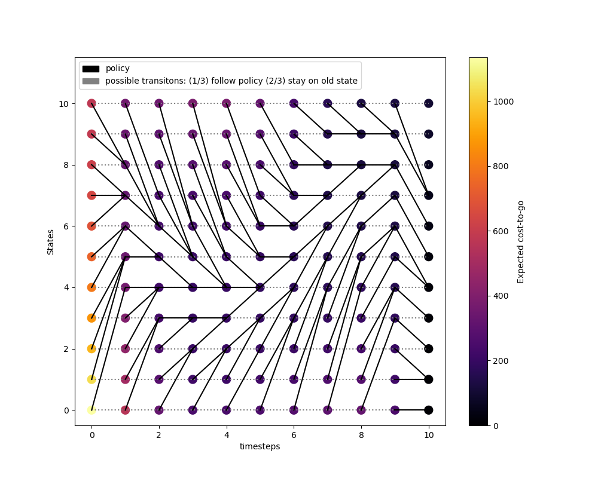

#### Content 
- Problem set 1: The Dynamic Programming Algorithm
- Problem set 2: Infinite Horizon Problems, Value Iteration, Policy Iteration, Discounted Problems
- Problem set 3: Deterministic Systems and the Shortest Path Problem

