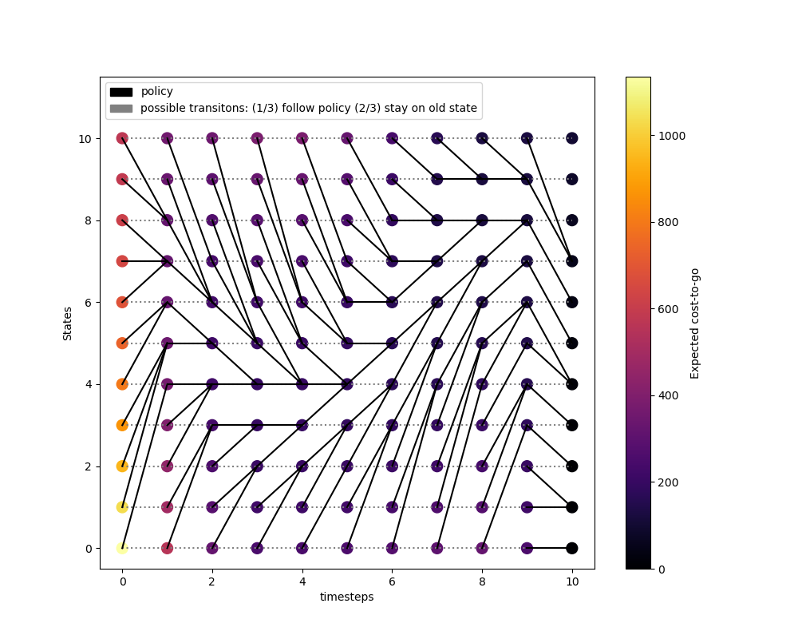

# Programming Exercises for Dynamic Programming and Optimal Control Class AS24 at ETHZ

Exercises in python, jupyter notebook

### Content

- Problem Set 1: Applications of the dynamic programming Algorithm DPA

